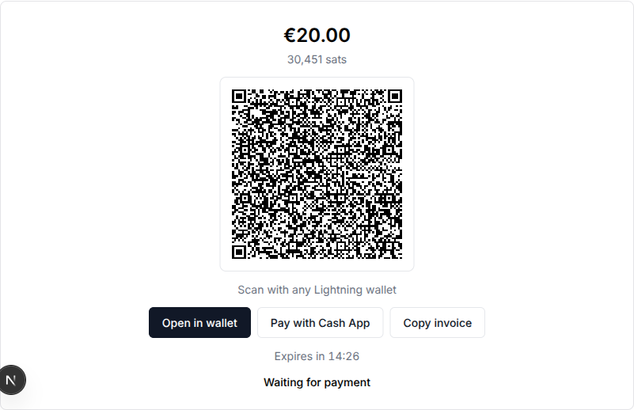
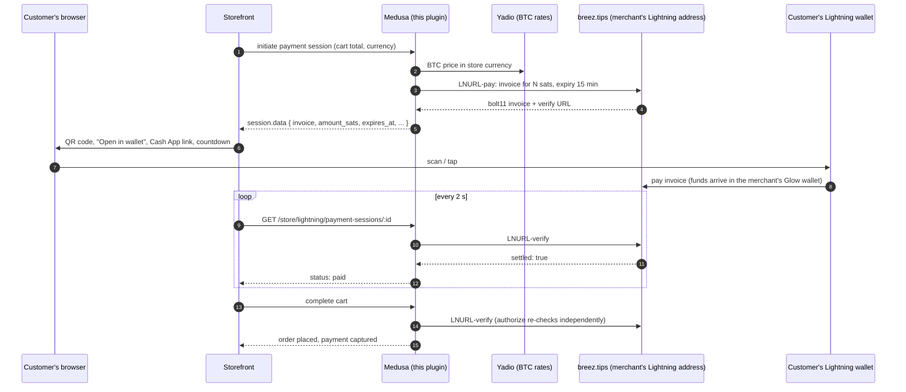
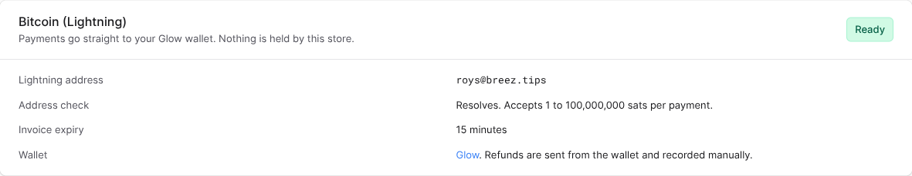

# medusa-payment-lightning

Accept Bitcoin over Lightning in a [Medusa](https://medusajs.com) v2 store. Customers pay a Lightning invoice from any wallet (Cash App, Strike, Phoenix, Glow, ...). The money lands in the merchant's own [Glow](https://breez.technology/glow/) wallet the moment it is paid.

- **No node, no server, no SDK.** The plugin talks HTTPS to the merchant's Lightning address ([LNURL-pay](https://github.com/lnurl/luds/blob/luds/06.md) for the invoice, [LNURL-verify](https://github.com/lnurl/luds/blob/luds/21.md) for settlement). Nothing to host or back up beyond your Medusa server.
- **Non-custodial.** Funds go straight to the merchant's wallet. The store never holds keys or balances.
- **Priced in your store currency.** Cart totals are converted to satoshis at checkout time and rounded up. The rate is recorded on the payment.
- **Ships the checkout screen.** An unstyled React `LightningPayment` component (QR code, wallet links, countdown, polling) for any React storefront, plus a demo based on the Medusa Next.js starter.
- **Admin widget.** Shows the configured address and checks it live from the Store settings page.

<p align="center"></p>

## How it works



Lightning payments are final, so a paid session is reported to Medusa as **captured** at authorization; there is no separate capture step.

Settlement is observed, never pushed, and it does not depend on the browser staying open:

- While the invoice is on screen, the storefront polls the plugin's status route, which runs LNURL-verify on every call.
- A scheduled job (every minute) verifies every open Lightning session and hands paid ones to Medusa's own process-payment workflow: it completes a cart the customer paid but never submitted, and authorizes an order that was placed before the payment arrived.
- If the customer places the order before paying (a custom storefront may allow it), the session is left in `pending_authorization`, the order shows as awaiting payment, and the job or the next status poll settles it once the invoice is paid.
- An invoice keeps being verified for 10 minutes after it expires, since a payment in flight at expiry can still land.
- Authorization always verifies the invoice, even past the grace window, so a payment observed by the job cannot be missed by the decision that settles the order.
- Running several Medusa instances needs the usual shared infrastructure: a shared locking provider (`@medusajs/locking-redis` or `locking-postgres`) and the Redis workflow engine, or a single instance in worker mode running scheduled jobs. Without it every instance runs the settlement job, and two can settle the same session at once. That is still safe: Medusa keeps one payment per session, the loser logs a warning with the underlying error and moves on, and Medusa logs the failed authorization attempt.
- If Medusa's own bookkeeping fails after the provider reported a payment captured (an order that cannot be created, for example), the plugin logs an error naming the session: the merchant has the funds and should check the order in the admin.

## Requirements

- Medusa >= 2.19 (plugins), Node >= 20.19 / 22.12.
- A Lightning address on **breez.tips**, which is what the Glow wallet issues. Install Glow from <https://breez.technology/glow/>, open Receive, copy the address (`name@breez.tips`). Other Lightning addresses are rejected: the plugin relies on the invoice expiry and LNURL-verify behaviour of that service.
- Outbound HTTPS from the Medusa server to `breez.tips` and `api.yadio.io`.

## Install

```bash
npm install medusa-payment-lightning
```

`medusa-config.ts`:

```ts
import { defineConfig } from "@medusajs/framework/utils"

module.exports = defineConfig({
  // ...
  plugins: [
    {
      resolve: "medusa-payment-lightning",
      options: {},
    },
  ],
  modules: [
    {
      resolve: "@medusajs/medusa/payment",
      options: {
        providers: [
          {
            resolve: "medusa-payment-lightning/providers/lightning",
            id: "lightning",
            options: {
              lightningAddress: process.env.LIGHTNING_ADDRESS, // you@breez.tips
              // expirySeconds: 900, // optional, 60..86400, default 15 minutes
            },
          },
        ],
      },
    },
  ],
})
```

The `plugins` entry registers the status route, the settlement job and the admin widget. The `modules` entry registers the payment provider; its id becomes `pp_lightning_<id>`, so `pp_lightning_lightning` with the config above.

Then enable **Bitcoin (Lightning)** for a region in the admin (Settings, Regions, Payment providers), or pass `payment_providers: ["pp_lightning_lightning"]` when creating regions.

The provider refuses to start with a missing or non-breez.tips address, or an expiry out of range. The admin widget on the Store settings page shows the configured address and whether breez.tips resolves it right now.

<p align="center"></p>

### Options

| Option | Required | Default | Description |
| --- | --- | --- | --- |
| `lightningAddress` | yes | | The merchant's `name@breez.tips` address. Lowercased. |
| `expirySeconds` | no | `900` | How long each invoice stays payable. 60 to 86400. |

## Storefront

### React component

```bash
npm install medusa-payment-lightning
```

The Medusa packages are optional peer dependencies, so installing the plugin in a storefront pulls in only the component and its QR code dependency, not the Medusa backend.

```tsx
"use client"
import { LightningPayment } from "medusa-payment-lightning/storefront"

<LightningPayment
  sessionId={paymentSession.id}          // payses_...
  initialData={paymentSession.data}      // renders the invoice before the first poll
  backendUrl="https://api.mystore.com"
  publishableKey={process.env.NEXT_PUBLIC_MEDUSA_PUBLISHABLE_KEY!}
  onPaid={() => completeCart()}          // place the order here
  onExpired={() => setShowNewInvoiceButton(true)}
/>
```

The component renders the fiat amount and sats, a QR code (`lightning:` URI), an **Open in wallet** link, a **Pay with Cash App** link, **Copy invoice**, a countdown and a status line. It polls `GET /store/lightning/payment-sessions/:id` every 2 seconds until the payment is paid, expired or canceled, and calls `onPaid` / `onExpired` once each.

It is unstyled. The root has class `lightning-payment` and a `data-status` attribute (`pending`, `paid`, `expired`, `canceled`, `loading`, `error`); children carry `lightning-payment__amount`, `__fiat`, `__sats`, `__qr`, `__hint`, `__actions`, `__button` (with `--wallet`, `--cashapp`, `--copy`), `__countdown`, `__status`. See [`demo/storefront-overlay/src/styles/lightning-payment.css`](demo/storefront-overlay/src/styles/lightning-payment.css) for a starting point.

Props:

| Prop | Description |
| --- | --- |
| `sessionId` | The Medusa payment session id. |
| `backendUrl`, `publishableKey` | Where to poll. Or pass `fetchPayment` instead. |
| `fetchPayment(sessionId, signal)` | Custom transport, for example a Next.js server action that calls the backend with the store's SDK (used by the demo). |
| `initialData` | `payment_session.data` from the cart, for an instant first render. |
| `onPaid`, `onExpired`, `onError` | Callbacks. `onPaid` is where the cart gets completed. |
| `pollIntervalMs` | Default `2000`. |
| `showCashApp` | Default `true`. |
| `qrSize` | Default `220`. |
| `locale`, `labels` | Formatting and copy overrides. |
| `className`, `style`, `children` | `children` render under the status line (a "Get a new invoice" button once expired, for example). |

Also exported: `fetchLightningPayment`, `paymentFromSessionData`, `isLightningProvider`, `formatSats`, `formatFiat`, and the `LightningPayment` type.

### Without the component

Everything the component needs is on the payment session Medusa returns with the cart, in `payment_session.data`:

| Field | Meaning |
| --- | --- |
| `invoice` | bolt11 invoice. Show it as a QR of `lightning:<INVOICE>` and as an `lightning:` link. Cash App deep link: `https://cash.app/launch/lightning/<invoice>`. |
| `amount_sats` | What the customer pays. |
| `amount`, `currency_code`, `rate` | The store-currency total, its currency, and the BTC price used. |
| `expires_at`, `created_at` | ISO timestamps. |
| `status` | `pending`, `paid`, `expired`, `canceled` as of the last check. |
| `paid_at` | Set once paid. |
| `lightning_address` | Where the funds go. |
| `verify_url` | Internal. Do not call it from the browser; use the status route. |

Live status: `GET /store/lightning/payment-sessions/:id` with the `x-publishable-api-key` header returns `{ payment_session: { id, status, invoice, lightning_uri, cash_app_url, amount_sats, amount, currency_code, rate, lightning_address, created_at, expires_at, paid_at } }`. Each call verifies against breez.tips. When `status` is `paid`, complete the cart.

A cart total change (Medusa calls `updatePayment`) issues a fresh invoice for the new amount; the old one is left to expire. A paid session is never re-issued.

## Merchant notes

- **Refunds** cannot be automated over Lightning. Attempting one in the admin fails with instructions: send the amount back from your Glow wallet and record the refund manually. The payment stays captured in Medusa.
- **Expired and unpaid** invoices past the 10 minute grace fail authorization; the customer gets a new invoice. An order placed before paying whose invoice then dies stays awaiting payment; cancel it in the admin.
- **Rates** come from Yadio's BTC table. The plugin caches it for 60 seconds, refuses a table older than 15 minutes, retries a failed connection once, times out after 5 seconds per attempt and, after a failure, fails fast for 5 seconds instead of retrying per checkout. With rates unavailable, initiating a Lightning payment fails with `exchange_rate_unavailable`; no stale price is ever quoted. Conversion is done in integer millisatoshis and rounded up to the next satoshi.
- **Amount limits** are the address's own `minSendable` / `maxSendable`; a total outside them fails with `amount_out_of_range` and the range in the message.
- **Fees.** The customer's wallet pays routing fees. The merchant receives the full invoiced amount less whatever their wallet's inbound fee is; there is no plugin fee.

### Error codes

`MedusaError.code` values the plugin raises: `invalid_options`, `invalid_lightning_address`, `lightning_address_not_found`, `lightning_service_unavailable`, `lightning_verify_unsupported`, `exchange_rate_unavailable`, `invalid_currency`, `invalid_amount`, `amount_out_of_range`, `payment_session_not_found`, `refund_not_supported`, `cancel_not_supported`.

## Demo store

`demo/` holds a Medusa backend configured with this plugin and an overlay for the [Medusa Next.js starter](https://github.com/medusajs/nextjs-starter-medusa) that wires `LightningPayment` into the review step of checkout. No Postgres install needed: the backend ships a script that runs an embedded one.

```bash
git clone https://github.com/kingonly/medusa-payment-lightning
cd medusa-payment-lightning
./demo/setup.sh                     # builds the plugin, installs backend + storefront
# edit demo/backend/.env: LIGHTNING_ADDRESS=you@breez.tips

cd demo/backend && npm run db       # terminal 1: embedded Postgres
cd demo/backend && npm run setup && npm run dev     # terminal 2: migrate, seed, admin user, start
cd demo/storefront && npm run dev   # terminal 3, after setting NEXT_PUBLIC_MEDUSA_PUBLISHABLE_KEY in .env.local
```

Store at <http://localhost:8000>, admin at <http://localhost:9000/app> (`admin@example.com` / `supersecret`). The publishable key is under Settings, Publishable API keys.

What the overlay changes in the starter, all under [`demo/storefront-overlay/src`](demo/storefront-overlay/src):

- `lib/constants.tsx`: label and icon for `pp_lightning_lightning`, `isLightning()`.
- `lib/data/lightning.ts`: server action that fetches the status route with the store SDK.
- `modules/checkout/components/lightning-payment/index.tsx`: the review step for Lightning. Places the order on `onPaid`, offers a new invoice on expiry.
- `modules/checkout/components/payment-button/index.tsx`: routes Lightning sessions to that component.
- `styles/lightning-payment.css`: styling for the component.

## Development

```bash
npm install
npm test            # vitest: provider, settlement, routes, job against a fake breez.tips and fake Yadio
npm run typecheck
npm run lint
npm run build       # .medusa/server (plugin) + dist/storefront (component)
```

After changing the plugin, `./demo/setup.sh` rebuilds it and reinstalls it into the demo apps; restart the backend afterwards. `npx medusa exec ./src/scripts/check-lightning.ts` in `demo/backend` prints the open Lightning sessions the settlement job would verify, and `npx medusa exec ./src/scripts/repro-deferred.ts` drives the order-first-pay-later path end to end against a stubbed breez.tips, so the settlement code can be exercised without spending sats.

Note for `medusa develop`: its file watcher restarts the server on every change under the backend folder, and a stopped-looking dev server may still be alive. Stale instances all run the settlement job against the same database, which is safe but noisy. Check with `pgrep -fa "cli.js start"` before assuming only one server is running.

Layout:

```
src/
  lib/lightning/        LNURL client, Yadio rates, options, session data contract, settlement helpers
  providers/lightning/  the payment provider (AbstractPaymentProvider)
  api/store/lightning/payment-sessions/[id]   status route (LNURL-verify on read)
  api/admin/lightning/settings                admin widget data (live address check)
  jobs/settle-lightning-payments.ts           every minute: verify open sessions, settle paid ones
  admin/widgets/lightning-settings.tsx        Store settings widget
  storefront/index.tsx                        LightningPayment React component
demo/                   backend + storefront overlay + setup script
```

## Why only breez.tips?

The plugin has no wallet of its own, so it depends on the Lightning address service to honour an invoice `expiry` and to implement LNURL-verify. breez.tips does both; the allow-list is one constant (`LNURL_DOMAIN`) should that widen.

## License

MIT. Built by [Roy Sheinfeld](https://github.com/kingonly), co-founder of [Breez](https://breez.technology), whose Glow wallet the merchant receives into.
